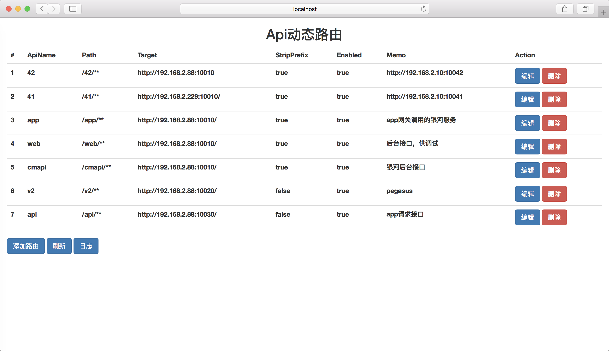

### zuul-gateway

基于SpringCloud构建的一个网关应用。

作为一个java后台，在日常工作中，偶尔需要临时把一个请求转发到我们的开发机上，
如果是对接前端还好修改，修改前端配置刷新页面即可。
如果对接App呢，这就需要重新打包安装了，或者可以修改nginx配置文件，重启nginx，甚是麻烦。
也可以在App启动的时候获取要访问的主机，由用户选择，终究还是麻烦，app还要特殊处理。

想找一个类似nginx但可以动态配置的，各种搜索找到了zuul。



页面启用了WebSocket，在多用户同时打开的情况下，一个用户修改，会自动同步其它用户的浏览器窗口，
避免出现未刷新页面，一直以为在请求自己的机器，其实早就被别人改了。

鉴于学习目的，这里使用了两种方式连接Socket，二者区别这里不细说。

### 其它

- nginx websocket 的配置

若未特殊配置，nginx中将不会转发WebSocket，但使用Stomp.js的话，创建WebSocket失败之后会自动转为长轮询。

```conf
server {
    ... # 省略若干配置
    localtion / {
        proxy_pass              http://172.17.0.1:8080;
    
        # 关于socket主要增加以下3行
    	proxy_http_version 1.1;
        proxy_set_header Upgrade $http_upgrade;
        proxy_set_header Connection "upgrade";

        proxy_headers_hash_max_size             51200;
        proxy_headers_hash_bucket_size          6400;
        proxy_set_header        Host            $host;
        proxy_set_header        X-Forwarded-For $proxy_add_x_forwarded_for;
    	proxy_set_header X-Forwarded-For $remote_addr;
    }
}
```
